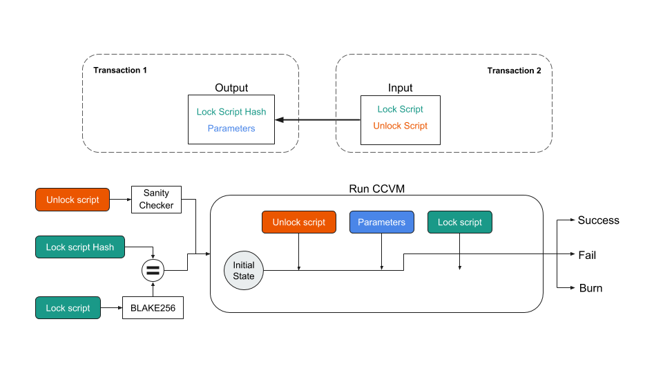

.. _lock-script:

#############################
Lock Script
#############################
Lock scripts are required in CodeChain when making a transaction to a different user. When attempting to
make a transaction, the sender must know the receiver's lock script so that the receiver can use his/her
private key to use/spend the newly received asset. This is analogous to sending money to someone's bank
account. Without knowing the receiver's bank account address, you cannot send money to the proper destination.
Lock scripts contain two parts: the lockScriptHash and parameter.

How are Lock Scripts Created?
==============================
When the user wants to receive any asset, he/she must create a private and public key pair.
The public key is then used to create a lock script that the user needs so that he/she can
receive assets. The codechain-sdk allows the lock scripts to be in a form of an address. This
address is fundamentally a bank address in the real world. Addresses can be decoded to reveal
a user's lockScriptHash and the parameter required to send a transaction.
