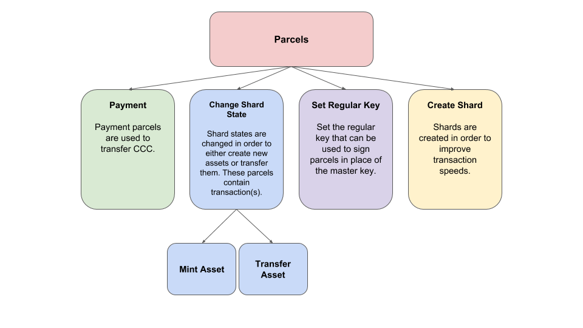

.. _parcel:

#####################
Parcel
#####################

Parcels can do a variety of things that change the state of various aspects within CodeChain. Obvious features
of parcels include trading assets and making payments. However, a less obvious feature involves setting a regular
key to accounts so that parcels can be signed with the regular key instead of the private key. Finally, there is
also a feature that allows users to create shards, where assets are stored and managed. Currently, the only type
of parcel that can hold multiple transactions within are those that involve assets(Change Shard State).

Transactions of assets can be batched into a single large parcel that is added to the blockchain. CodeChain was developed with
multi-asset management in mind, coupled with the ability for the service provider to pay transaction
fees for users. Asset transactions are collected at the gateway, which groups the transactions into parcels.
These gateways would be the service providers, and can pay the transaction fees for the parcels going through
the respective gateways. If users want to add their transactions directly onto the blockchain without the
need to go through a gateway, then they must pay their own transaction fees and create their own parcels.

A parcel would look something like this:
::

    pub struct Parcel {
        pub seq: U256,
        pub fee: U256,
        pub network_id: NetworkId,
        pub action: Action,
    }

    pub enum Action {
        AssetTransaction(Transaction),
        Payment {
            receiver: Address,
            value: U256,
        },
        SetRegularKey {
            key: Public,
        },
    }

The fee of the parcel would determine its priority, meaning, how quickly it gets processed. In addition, there is
also a minimum fee that can be set. The seq property exists for the purpose of preventing replay attacks.
