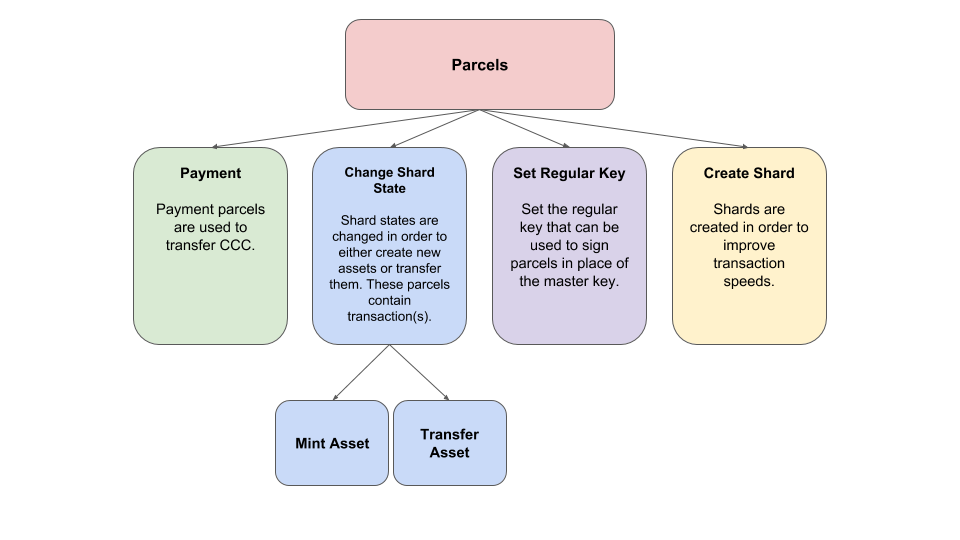

.. _transaction:

#####################
Transaction
#####################

Transactions can do a variety of things that change the state of various aspects within CodeChain. Obvious features
of transactions include trading assets and making payments. However, a less obvious feature involves setting a regular
key to accounts so that transactions can be signed with the regular key instead of the private key. Finally, there is
also a feature that allows users to create shards, where assets are stored and managed.

CodeChain was developed with multi-asset management in mind, coupled with the ability for the service provider to pay transaction
fees for users. Asset transactions are collected at the gateway. These gateways would be the service providers, and can pay the
transaction fees for the transactions going through the respective gateways. If users want to add their transactions directly onto
the blockchain without the need to go through a gateway, then they must pay their own transaction fees.

A transaction would look something like this:
::

    pub struct Transaction {
        pub seq: U256,
        pub fee: U256,
        pub network_id: NetworkId,
        pub action: Action,
    }

    pub enum Action {
        MintAsset {
            network_id: NetworkId,
            shard_id: ShardId,
            metadata: String,
            approver: Option<PlatformAddress>,
            administrator: Option<PlatformAddress>,

            output: AssetMintOutput,

            approvals: Vec<Signature>,
        },
        MintAsset {
            network_id: NetworkId,
            shard_id: ShardId,
            metadata: String,
            approver: Option<PlatformAddress>,
            administrator: Option<PlatformAddress>,

            output: AssetMintOutput,

            approvals: Vec<Signature>,
        },
        // ...
        Pay {
            receiver: Address,
            amount: U256,
        },
        SetRegularKey {
            key: Public,
        },
    }

The fee of the transaction would determine its priority, meaning, how quickly it gets processed. In addition, there is
also a minimum fee that can be set. The seq property exists for the purpose of preventing replay attacks.
