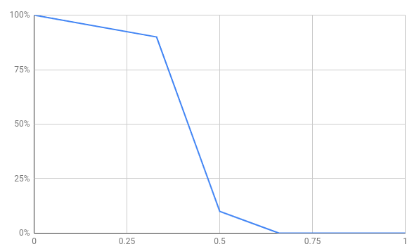

# Dynamic Validator

## Constants
| name                             | value         |
|----------------------------------|---------------|
| **TERM**                         | 1 hour        |
| **NOMINATION_EXPIRATION**        | 24 **TERM**s  |
| **CUSTODY_PERIOD**               | 24 **TERM**s  |
| **RELEASE_PERIOD**               | 240 **TERM**s |
| **WITHDRAW_DELAY**               | 1 **TERM**    |
| **MAX_NUM_OF_VALIDATORS**        | 30            |
| **MIN_NUM_OF_VALIDATORS**        | 4             |
| **DELEGATION_THRESHOLD**         | 100,000       |
| **MIN_DEPOSIT**                  | 10M CCC       |


## FSM of Account States
```
                                   +--------+
                        /--------->| Banned |<---+-------\
                        |          +--------+    |       |
                       (6)                      (6)      |
                        |                        |       |
+----------+ -(1)--> +-----------+ -(3)--> +-----------+ |
| Eligible |         | Candidate |         | Validator | |
+----------+ <--(2)- +-----------+ <--(4)- +-----------+ |
      ^                 ^                        |       |
      |                 |      +--------+ <--(5)-/       |
      |                 \-(7)- | Jailed | -(6)-----------/
      \-------------------(9)- +--------+
                                 ^     |
                                 |     |
                                 \-(8)-/
```
1. Send *SELF_NOMINATE*
2. No *SELF_NOMINATE* while **NOMINATE_EXPIRATION** terms
3. Elected
4. End of term and the validator worked
5. End of term and the validator didn't work
6. Double Vote detected
7. Send *SELF_NOMINATE* after **CUSTODY_PERIOD**
8. Send *SELF_NOMINATE* before **CUSTODY_PERIOD**
9. No *SELF_NOMINATE* during **RELEASE_PERIOD**

## Term
The term is a period when one elected validator set works, and lasts for almost an hour
The block that has a different generation hour from the parent block's is the last block of a term.
CodeChain elects a new validator set after all rewards of the block is given.

## Nomination
Any account that is not banned can nominate itself.
The nomination expires after **NOMINATION_EXPIRATION**; the account that wants to remain a candidate must nominate itself before the previous nomination expires.
The deposit reverts to the account when it becomes an eligible account.

### Minimum Deposit
The candidate who deposits less than **MIN_DEPOSIT** cannot participate in the election.
The candidate can deposit more than **MIN_DEPOSIT**, but they cannot withdraw it manually.

## Delegation
The stakeholders have the right to choose validators as much as their shares.
This is called delegation, and the stakeholders who have delegated called delegators.
The delegation is valid only when the delegatee is not an eligible or not banned.
The delegated stakes are returned when the account becomes an eligible account or a banned account.

## Election
The election is a process that elects validators of a term according to the following rule:

1. Select the candidates who deposited **MIN_DEPOSIT** or more.
2. Pick **MAX_NUM_OF_VALIDATORS** candidates in order of having received many delegations.
3. Select **MIN_NUM_OF_VALIDATORS** accounts; they become validators.
4. Among the rest of them, drop the accounts that received less than **DELEGATION_THRESHOLD**; the remaining accounts become validators.

This process guarantees two things:
* There are at least **MIN_NUM_OF_VALIDATORS** validators only if the number of candidates is larger than **MIN_NUM_OF_VALIDATORS**.
* The candidates that are not in **MIN_NUM_OF_VALIDATORS** and not receiving delegation of more than **DELEGATION_THRESHOLD** will not be validators.

### Delegation Threshold
It's a constant threshold to prevent the accounts with little delegations from becoming validators.
Current **DELEGATION_THRESHOLD** is `100,000`, which is 1% of the total CCS(`10,000,000`).
It means there can be 100 valid candidates with the potential to be validators.

## The Order of Proposing Blocks
The rate of becoming the block proposer is related to the number of delegations that the validator received.
In other words, CodeChain allows the validator that receives more delegations to generate more blocks than others.

```rust
let mut validators: Vec<(u64, u64, Account)> = // (Delegation, Deposit, Account)
let mut proposers: Vec<Account> = vec![];
validators.reverse_sort();
let min_delegation = validator.last().0;
while !validators.is_empty() {
    for (delegation, _, validator) in validators {
        proposers.push_back(validator);
    }
    validators.retain(|(delegation, _, _)| delegation > min_delegation);
    validators.for_each(|(mut delegation, _, _)| delegation -= min_delegation);
}
```

## Voting Power
Each elected validators has different voting power.
The voting power is based on the delegation that the validator received at the election.
The block is valid only if the sum of voting power is more than 2/3 of the total delegations that the elected validators received.

## Validator Reward
The block proposer gets the express fee of the blocks at the end of a term.
Validators can get the reward after **WITHDRAW_DELAY** terms; however, the proposers cannot get all the reward if they are not loyal to their duty.
The reward is decreased according to the rate of the blocks the validator misses to sign.

The reward is decreased when a validator doesn't sign blocks proposed by others.
The decreasing rate looks like the graph shown below:



If a validator misses 1/3 of the blocks, the reward is decreased by 10%.
If it misses more than 1/3 of the blocks, the reward decreases at much more rapid rate, up to 90%.
Finally, there is no reward at all if it misses more than 2/3 of the blocks.

This penalty is applied in cases of disloyal behavior.
However, some validators can exploit it by rejecting other validators' signatures to their proposal.
To prevent this issue, CodeChain encourages validators who collect signatures diligently by giving additional rewards.

The additional reward algorithm is shown below:
```rust
let total_validators: Vec<Vec<Account>> := // sorted validators into the average number of signatures;
let mut remain_reward = // total reduced rewards
for validators in total_validators {
    if validators.is_empty() {
        break;
    }
    let reward = floor(remain_reward / (top_validators.len() + 1))
    if reward == 0 {
        break;
    }
    for validator in validators {
        give_ccc(validator, reward);
        remain_reward -= reward;
    }
}
```
The remaining rewards as a result of the additional reward algorithm are burned.
At the worst case, **MAX_NUM_OF_VALIDATORS** CCC can be burned every term.

## Punishment for Validators
### Downtime
The validator who doesn't produce blocks is jailed for a while.
The jailed account cannot be a candidate during **CUSTODY_PERIOD**.
*SELF_NOMINATE* transactions of the account are rejected; however, this is not a punishment.
It is to give validators time to fix the nodes that they manage.
The jailed account can nominate itself again after **CUSTODY_PERIOD**.

### Disloyal Validators
CodeChain gives a penalty to validators who doesn't participate in signing the blocks proposed by other nodes.
See [Validator Reward](#Validator-Reward) for more information.

### Double Vote
CodeChain bans the account who double voted.
The deposit and the reward the criminal earns is slashed and is given to the informant reporting the double vote.

## Transactions
### SELF_NOMIATION
* quantity
* metadata

This transaction registers the sender to the candidate.
The nomination is valid in **NOMINATE_EXPIRATION**.

The account cannot withdraw the deposit manually, and is returned automatically when the account becomes an eligible account.

The metadata is text information that proves the identity of the candidate.
It can be a URL, a phone number, a messenger Id, etc.

### WITHDRAW
* quantity

This transaction withdraws the reward that the node earns as a validator.
But the validator cannot withdraw the reward before **WITHDRAW_DELAY** passes.

The transaction that tries to withdraw more than what the account has will fail.

### DELEGATE
* delegatee
* quantity

It's a transaction used by the stakeholders to select the validators.
The stakeholders can delegate as much stakes as they have.
The stakeholders can delegate any candidates, including validators and jailed accounts.
The delegations return automatically when the delegatee becomes eligible or banned.

*DELEGATE* transactions to banned or eligible accounts fail.


### REVOKE
* delegatee
* quantity

It's a transaction used by the stakeholders to revoke the delegation.
The stakeholders can revoke delegations at any time without delay.
The revoke occurs immediately, but the validator cannot be ousted before its term is over.

The transaction fails when the delegator revokes more than it delegates.

### REPORT_DOUBLE_VOTE
* header1
* sig1
* header2
* sig2

This is a transaction that reports malicious validator.
The **REPORT_DOUBLE_VOTE** should be reported during **WITHDRAW_DELAY**.
The transaction that reports a double vote have occurred before **WITHDRAW_DELAY** fails.

The criminal loses all his deposit and rewards and is banned immediately; it is the only case where a validator set is changed during the term.

The informant receives all deposit and rewards(TBD) as prize money immediately.

The criminal becomes a banned account.
The account cannot become a candidate anymore.
In other words, the *DELEGATE* transaction to the banned account and the *SELF_NOMINATE* transaction from the banned account fail.
